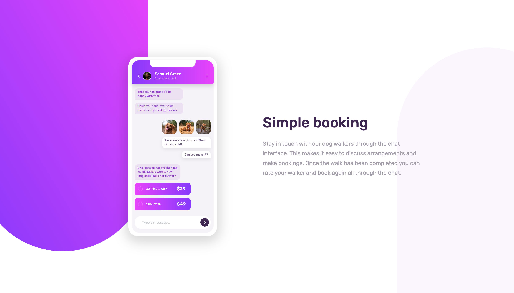

# Frontend Mentor - Chat app CSS illustration solution

This is a solution to the [Chat app CSS illustration challenge on Frontend Mentor](https://www.frontendmentor.io/challenges/chat-app-css-illustration-O5auMkFqY).

## Table of contents

- [Overview](#overview)
  - [The challenge](#the-challenge)
  - [Screenshot](#screenshot)
  - [Links](#links)
- [My process](#my-process)
  - [Built with](#built-with)
  - [What I learned](#what-i-learned)
  - [Continued development](#continued-development)
  - [Useful resources](#useful-resources)
- [Author](#author)

## Overview

### The challenge

Users should be able to:

- View the optimal layout for the component depending on their device's screen size
- **Bonus**: See the chat interface animate on the initial load

### Screenshot



### Links

- Solution URL: [https://github.com/kongguksu/chat-app-css-illustration.git]
- Live Site URL: [https://kongguksu.github.io/chat-app-css-illustration/]

## My process

### Built with

- Semantic HTML5 markup
- CSS custom properties
- Flexbox
- CSS Grid
- Desktop-first workflow

### What I learned

I learned to animate elements on initial load of the website using @keyframes and animation properties.

```css
@keyframes moveInLeft {
  0% {
    opacity: 0;
    transform: translateX(-100%);
  }

  80% {
    transform: translate(10px);
  }

  100% {
    opacity: 1;
    transform: translateX(0);
  }
}

@keyframes moveInRight {
  0% {
    opacity: 0;
    transform: translateX(100%);
  }

  80% {
    transform: translate(-10px);
  }

  100% {
    opacity: 1;
    transform: translateX(0);
  }
}

body::after {
  backface-visibility: hidden;

  animation: moveInLeft 0.8s ease-in-out;
}

body::before {
  backface-visibility: hidden;

  animation: moveInRight 0.8s ease-in-out;
}

@keyframes moveUp {
  0% {
    opacity: 0;
    transform: translateY(50px);
  }

  80% {
    transform: translateY(-10px);
  }

  100% {
    opacity: 1;
    transform: translateY(0);
  }
}

@keyframes moveDown {
  0% {
    opacity: 0;
    transform: translateY(-50px);
  }

  80% {
    transform: translateY(10px);
  }

  100% {
    opacity: 1;
    transform: translateY(0);
  }
}

.app-container {
  backface-visibility: hidden;

  animation: moveDown 1s ease-in-out;
}

.intro-container {
  backface-visibility: hidden;

  animation: moveUp 1s ease-in-out;
}
```

### Continued development

In the process of adding animation, I noticed that a scrollbar appears on the right side of the animated elements when the screen size is smaller and I'm trying to search how to get rid of it, but I'm having a bit of difficulty figuring that out. I will continue to search for ways to fix this.

### Useful resources

- [Example resource 1](https://css-tricks.com/hide-scrollbars-during-an-animation/)
- [Example resource 2](https://stackoverflow.com/questions/20973870/scrollbar-appears-through-css-animation-transition)

## Author

- Frontend Mentor - [@kongguksu](https://www.frontendmentor.io/profile/kongguksu)
- Twitter - [@sooj2050](https://www.twitter.com/sooj2050)
